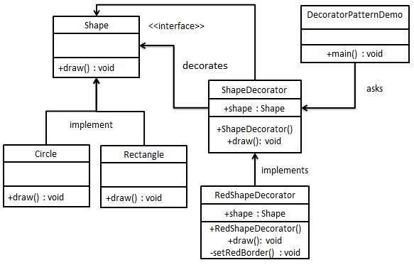
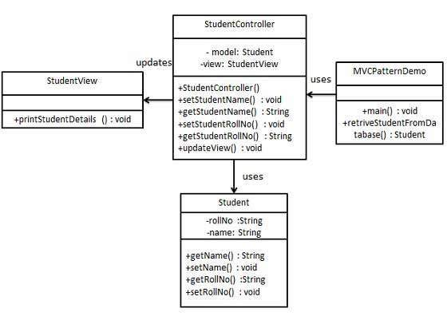

# Object Oriented Design Patterns
#### Factory

```java
public class ShapeFactory {
   //use getShape method to get object of type shape
   public Shape getShape(String shapeType){
      if(shapeType == null){
         return null;
      }
      if(shapeType.equalsIgnoreCase("CIRCLE")){
         return new Circle();
      } else if(shapeType.equalsIgnoreCase("RECTANGLE")){
         return new Rectangle();
      } else if(shapeType.equalsIgnoreCase("SQUARE")){
         return new Square();
      }
      return null;
   }
}

public class FactoryPatternDemo {
   public static void main(String[] args) {
      ShapeFactory shapeFactory = new ShapeFactory();
      //get an object of Circle and call its draw method.
      Shape shape1 = shapeFactory.getShape("CIRCLE");
      //call draw method of Circle
      shape1.draw();
   }
}
```
#### Observer
Observer pattern is used when there is one-to-many relationship between objects such as if one object is modified, its depenedent objects are to be notified automatically. Observer pattern falls under behavioral pattern category.

#### Singleton

#### Decorator
Decorator pattern allows a user to add new functionality to an existing object without altering its structure. This type of design pattern comes under structural pattern as this pattern acts as a wrapper to existing class.

#### Strategy
In Strategy pattern, a class behavior or its algorithm can be changed at run time. This type of design pattern comes under behavior pattern. In Strategy pattern, we create objects which represent various strategies and a context object whose behavior varies as per its strategy object. The strategy object changes the executing algorithm of the context object.

#### State 
In State pattern a class behavior changes based on its state. This type of design pattern comes under behavior pattern. In State pattern, we create objects which represent various states and a context object whose behavior varies as its state object changes.

```java
public class StartState implements State {
   public void doAction(Context context) {
      System.out.println("Player is in start state");
      context.setState(this);
   }
   public String toString(){
      return "Start State";
   }
}

public class Context {
   private State state;
   public Context(){
      state = null;
   }
   public void setState(State state){
      this.state = state;
   }
   public State getState(){
      return state;
   }
}

public class StatePatternDemo {
   public static void main(String[] args) {
      Context context = new Context();

      StartState startState = new StartState();
      startState.doAction(context);

      System.out.println(context.getState().toString());

      StopState stopState = new StopState();
      stopState.doAction(context);

      System.out.println(context.getState().toString());
   }
}
```
#### Proxy
In proxy pattern, a class represents functionality of another class. This type of design pattern comes under structural pattern. In proxy pattern, we create object having original object to interface its functionality to outer world.

```java
public class RealImage implements Image {
   private String fileName;

   public RealImage(String fileName){
   }

   @Override
   public void display() {
   }

   private void loadFromDisk(String fileName){
   }
}

public class ProxyImage implements Image{

   private RealImage realImage;
   private String fileName;

   public ProxyImage(String fileName){
      this.fileName = fileName;
   }

   @Override
   public void display() {
      if(realImage == null){
         realImage = new RealImage(fileName);
      }
      realImage.display();
   }
}

public class ProxyPatternDemo {

   public static void main(String[] args) {
      Image image = new ProxyImage("test_10mb.jpg");

      //image will be loaded from disk
      image.display();
      System.out.println("");

      //image will not be loaded from disk
      image.display();
   }
}
```
#### Composite

```java
public class Employee {
   //...
   private List<Employee> subordinates;

   // constructor
   public Employee(String name, String dept, int sal) {
      this.name = name;
      this.dept = dept;
      this.salary = sal;
      subordinates = new ArrayList<Employee>();
   }

   // ....
   public List<Employee> getSubordinates(){
     return subordinates;
   }
}
```
#### Builder

```java
public class MealBuilder {

   public Meal prepareVegMeal (){
      Meal meal = new Meal();
      meal.addItem(new VegBurger());
      meal.addItem(new Coke());
      return meal;
   }

   public Meal prepareNonVegMeal (){
      Meal meal = new Meal();
      meal.addItem(new ChickenBurger());
      meal.addItem(new Pepsi());
      return meal;
   }
}
```
#### MVC(Model-View-Controller)

#### Visitor
In Visitor pattern, we use a visitor class which changes the executing algorithm of an element class. By this way, execution algorithm of element can vary as and when visitor varies. This pattern comes under behavior pattern category. As per the pattern, element object has to accept the visitor object so that visitor object handles the operation on the element object.
```java
public class Keyboard implements ComputerPart {
   @Override
   public void accept(ComputerPartVisitor computerPartVisitor) {
      computerPartVisitor.visit(this);
   }
}

public class Computer implements ComputerPart {
   ComputerPart[] parts;

   @Override
   public void accept(ComputerPartVisitor computerPartVisitor) {
      for (int i = 0; i < parts.length; i++) {
         parts[i].accept(computerPartVisitor);
      }
      computerPartVisitor.visit(this);
   }
}

public interface ComputerPartVisitor {
	public void visit(Computer computer);
	public void visit(Mouse mouse);
	public void visit(Keyboard keyboard);
	public void visit(Monitor monitor);
}
```
